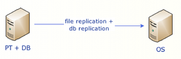
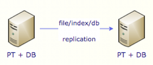

# High Availability


PaperTrail support 4 distinct modes of HA operation:

1. Replication
2. Clustering
3. Cold/Warm Standby


### Master Node

Whether using replication or clustering, which node is configured as master will matter is it is responsible for running a number of background jobs including:

* workflow and allocation timeouts
* scheduled rules
* out of office start/end
* diarize start
* reminders

Should the master fail, a new master needs to be configured.

**Email** and **Folder** watches are configured per server/node so that load can be manually balanced, should a node fail, then the watches that were configured for it will need to be manually moved.

### File Replication

 PaperTrail has a builtin file replication engine that supports both **master-master** and **master-slave** it is configued by specifying:
 ```
 file.replication.upstream=http://slave:8080  
 ```

 In the background this configures 2 File/Blob stores:

 1. A sync local filesystem store (only a single sync store is supported and is considered the primary)
 2. An async persistent sencondary store   

>**Async** stores fully support intermittent WAN connections and will retry all operations. All operations are queued under the `{store name}.write` and  `{store name}.delete` message queues


Their are 2 alternatives to full replication of files:

1. configure the slave or secondary members to read/write files from the master using a **HTTP** store as the primary sync store. It is recommended to enable **WORM** (Write once read many) on secondary nodes 
2. Use an object storage platform like Amazon S3 and have all members use it as the primary 

> PaperTrail needs low latency access to the primary sync file store so if you are using Amazon S3 ensure that PaperTrail is hosted in the same AWS region as the  S3 bucket.


### Index Replication

Specifing a slave server for `index.upstream` will only work for 2 node clusters, for 2+ nodes switch to messaging based replication using:
```
index.upstream=topic
```

It is recommended in both scenarios to setup a scheduled `index_repair` task.


## Replication


To convert a standalone installation to a replicated installation, follow these steps:  

*  Stop PaperTrail and create a **database backup**.  
*  Configure the following properties in **papertrail.properties** on the master

```javascript
index.upstream=http://slave:8080
replication.upstream=http://slave:8080  
file.replication.upstream=http://host:8080  
replication.master=true  
replication.increment=2  
replication.offset=1  
db.identity.override=true # for sql server replication only  
```

*  Configure these properties on the slave:  

```javascript
index.upstream=http://master:8080  
replication.upstream=http://master:8080
file.replication.upstream=http://master:8080  
replication.master=false  
replication.increment=2  
replication.offset=2  
db.identity.override=true # for sql server replication only  
```

*  Start up the master
*  Wait a few minutes and start up the slave

## Clustering


> Note: Clustering requires a low latency (<1ms), reliable (preferably dual path redundant network) network connection to function correctly.  Replication can be used in WAN environments.

1. Ensure that port `5701` is open for inbound traffic from all cluster members to all cluster members. See [Hazelcast Ports](http://docs.hazelcast.org/docs/3.3/manual/html/ports.html)
2. Add these properties to the **papertrail.properties**  
```
index.upstream=http://slave:8080
cluster.enable=true
file.replication.upstream=http://slave:8080  
```
1.  Restart PaperTrail.


### Shared DB vs Replication DB


## Cold Standby



Indexes are not replicated and PaperTrail is only started in file store replication receive mode. Failover requires re-configuration of PaperTrail for full operation + rebuilding indexes.

## Warm Standby




Everything is replicated in near realtime, and PaperTrail is started in read only mode. Failover requires restarting PaperTrail in read/write mode. 
