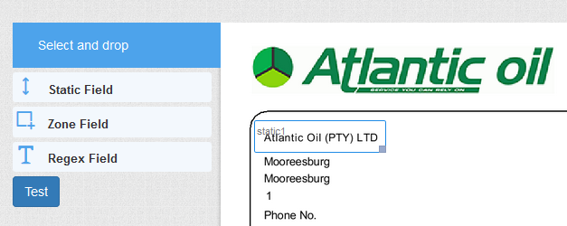
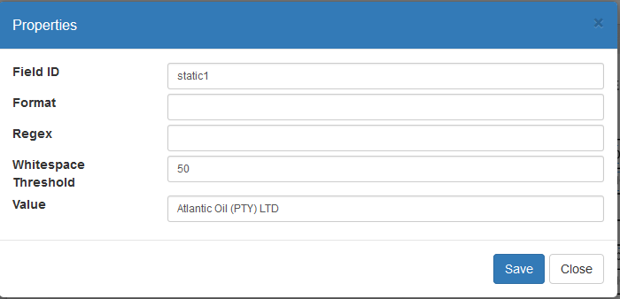
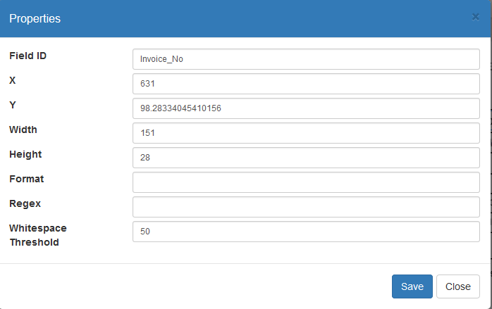
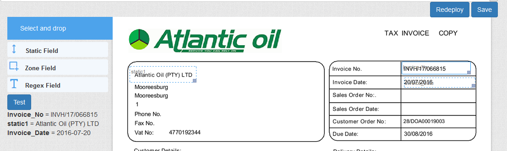

# Template Extraction 

## Extract from Templates

1. Setup a folder called **'extraction templates'**
2. Extract templates from cloud client who has this setup.
3. Bulk Export to obtain the extraction zones.
4. Import the templates in the admin section from Tasks->Documents Archive.
5. Add extract from template rules to those nodes that need to be setup.
           

## Setting up and Configuring Extract from Template rules

*  Add new extraction templates node under System as follow  
 
*  Import or copy documents ( PDF based ) to the extraction templates node, that you will be setting up as a template.  
*  Setup new extractFromTemplates rule on the node where the documents will be importing.   
 
*  Select the Template Editor for the Template editor to open in a new window.   
*  Select one of the documents that have been copied to your extraction templates node from the drop down
  
*  Add a new Static Field ( This field will be used to recognize the document to use with this template ) 
   
*  Ensure you add your default value for the documents to be recognized 
   
*  Add the new Zone Fields ( This will be configure for the Indexes ) 
Change the field ID to match your index name. 
   
*  Position the field on the document where you want the information to read from the document. 

*  Once completed hit the save and Redeploy button to save your work to start testing.  

