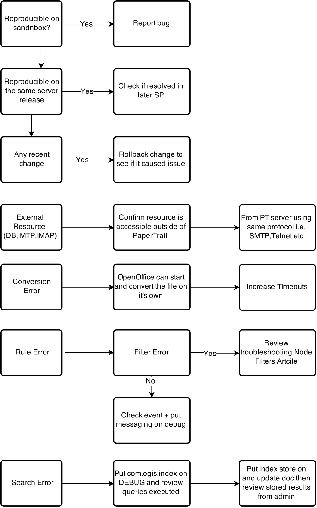

# Troubleshooting Server

## Isolate the Problem

## Solve the Problem 

*  Start with the client and release.  
*  Ensure that all the steps are followed.  
*  Include any information used in troubleshooting logs, release testing etc that may help identifying the issue.  
*  Any error must be accompanied by the corresponding log entry.  
*  Check the knowledge base first.  
*  Ask for help in the Support Room only.  
*  Add knowledge base article.  