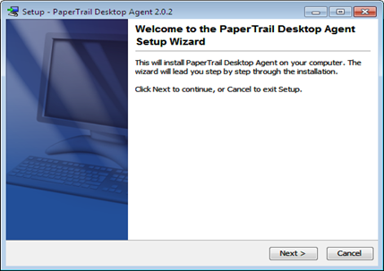
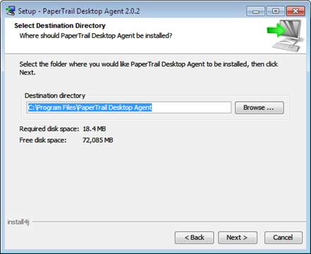
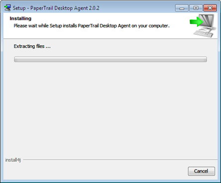
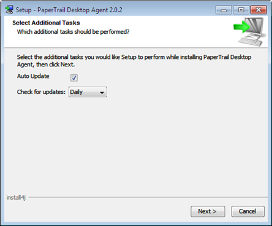
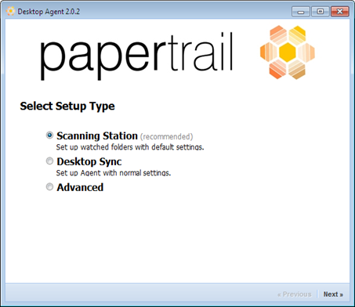
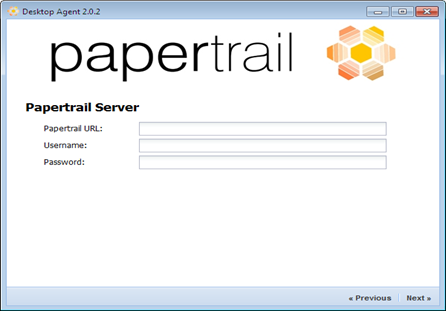
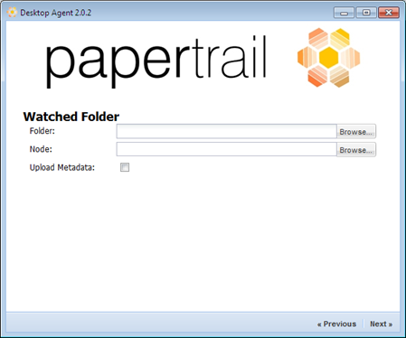
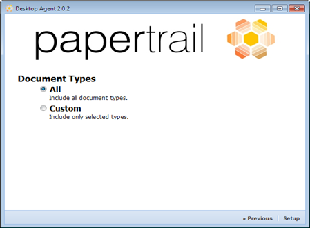
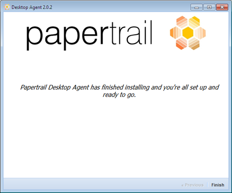

# Desktop Agent

1.  Click Next to proceed with installation.  

2.  After selecting destination directory, click Next.   

3.  Enable the Create a Start Menu Folder and click Next.  

4.  Please wait while PaperTrail Desktop Agent is installed.  

5.  Select Additional Tasks and click Next.  

6.  Click Finish.  

7.  After the installation, select a Setup Type and click Next.  

8.  You can enter your PaperTrail server details and click Next.  

9.  You can select your Watched Folders location as displayed and click Next.  

10.  Select a Document Type and click Next.  

11.  Click Finish to complete the setup process.  

12.  You can go to the following link to access the desktop agent: [http://localhost:8884](http://localhost:8884).

