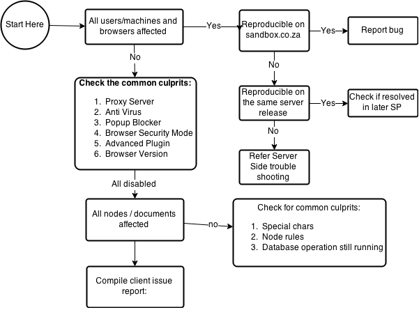

# Troubleshooting Issues on a Client

## Isolate the Problem

## Solve the Problem 

* Compare against [sandbox](sandbox.papertrail.co.za)  

## System Information

* Check browser console logs
* Check system and os level information using [Speccy](http://www.piriform.com/speccy) or [WinAudit](https://winaudit.codeplex.com)
* Check browser config via [check.papertrail.co.za](check.papertrail.co.za)
* Use [Fiddler4](https://releases.papertrail.co.za/public/file/Other/fiddler4setup.exe/fiddler4setup.exe?download=true) to capture HTTP logs
* Check the log files for the Advanced Plugin
